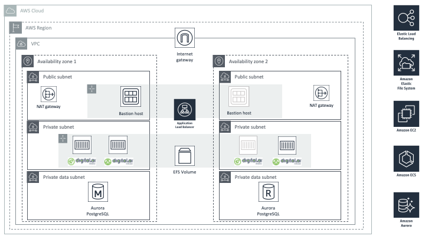

Deploying this Quick Start for a new virtual private cloud (VPC) with
*default parameters* builds the following _{partner-product-name}_ environment in the
AWS Cloud.

// Replace this example diagram with your own. Send us your source PowerPoint file. Be sure to follow our guidelines here : http://(we should include these points on our contributors giude)
:xrefstyle: short
[#architecture1]
.Quick Start architecture for _{partner-product-name}_ on AWS
[link=images/architecture_diagram.png]

As shown in <<architecture1>>, the Quick Start sets up the following:

* A highly available architecture that spans two Availability Zones.*
* A VPC configured with public and private subnets, according to AWS
best practices, to provide you with your own virtual network on AWS.*
*	An internet gateway to allow access to the internet. This gateway is used by the bastion hosts to send and receive traffic.*

In the public subnets:

* Managed network address translation (NAT) gateways to allow outbound
internet access for resources in the private subnets.*
* A Linux bastion host in an Auto Scaling group to allow inbound Secure
Shell (SSH) access to EC2 instances in public and private subnets.*

In the private application subnets:

* An Amazon Elastic Container Service (Amazon ECS) cluster running on EC2 instances for hosting the {partner-product-name} containers that contain the {partner-company-name} Release and {partner-company-name} Deploy modules

In the ECS cluster:

* A {partner-company-name} Release module set up in full cluster mode.
* A {partner-company-name} Deploy module set up in high-availability (hot-standby) mode.

In the private data subnets:

* An Amazon Aurora PostgreSQL cluster, for hosting the {partner-product-name} data.
*	An Amazon Elastic File System (Amazon EFS) volume, for hosting the disk-based configuration and data for the {partner-product-name}.

NOTE: Amazon Elastic File System (Amazon EFS) volumes are encrypted.

*	An Application Load Balancer for routing incoming user requests to the {partner-product-name} containers.

*The template that deploys the Quick Start into an existing VPC skips
the components marked by asterisks and prompts you for your existing VPC
configuration.
